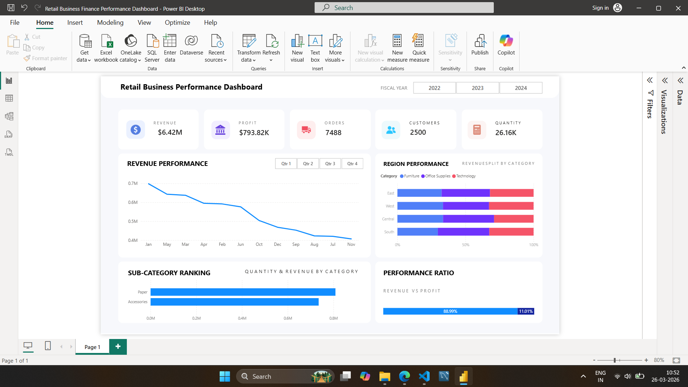

# 📊 Retail Business Finance Performance Dashboard

## 📌 Project Overview  
This project is a **Power BI dashboard** built to analyze and visualize retail business performance. It provides insights into revenue, profit, orders, customers, and product performance across different regions and categories.

The goal of this dashboard is to help stakeholders make **data-driven decisions** by identifying trends, top-performing segments, and areas of improvement.

---

## 🧾 Dataset  
The dataset contains retail business data including:
- Sales / Revenue  
- Profit  
- Orders  
- Customer details  
- Product categories & sub-categories  
- Region-wise data  

---

## 📈 Key Features  

- **KPIs Overview**
  - Total Revenue  
  - Total Profit  
  - Total Orders  
  - Total Customers  
  - Quantity Sold  

- **Revenue Analysis**
  - Monthly revenue trend  
  - Quarterly filtering (Q1–Q4)  

- **Region Performance**
  - Revenue distribution across regions  
  - Category-wise comparison  

- **Sub-Category Ranking**
  - Top-performing sub-categories based on revenue  

- **Performance Ratio**
  - Revenue vs Profit comparison  

- **Interactive Filters**
  - Fiscal Year (2022, 2023, 2024)  
  - Quarter selection  

---

## 🛠️ Tools & Technologies  
- Power BI  
- Data Modeling  
- DAX (for calculated measures)  
- Data Cleaning & Transformation  

---

## 📷 Dashboard Preview  

---

## 🚀 How to Use  

1. Download the `.pbix` file from this repository  
2. Open it in Power BI Desktop  
3. Load dataset if required  
4. Interact with filters and visuals  

---

## 📊 Key Insights  

- Revenue shows a declining trend towards the end of the year  
- Certain regions contribute more consistently to revenue  
- Some sub-categories outperform others significantly  
- Profit is a smaller proportion compared to total revenue  
